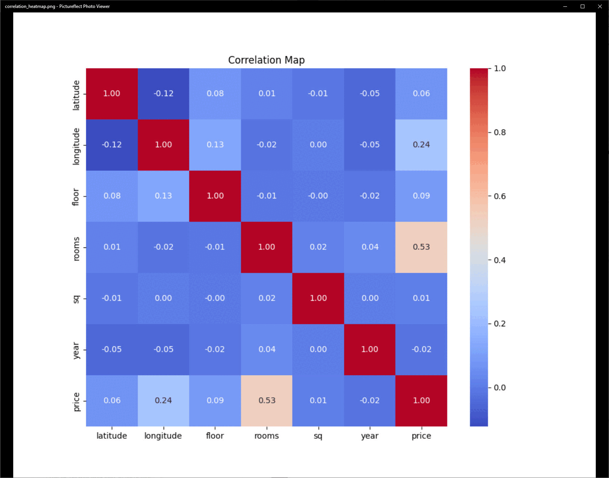

# 🏠 Housing Price Prediction with Neural Networks 📈
_Leveraging TensorFlow to accurately estimate property prices in Polish cities based on key features._

[](https://opensource.org/licenses/MIT)
[](https://www.python.org/)
[](https://www.tensorflow.org/)
[](https://scikit-learn.org/)
[](https://numpy.org/)
[](https://pandas.pydata.org/)
[](https://matplotlib.org/)
[]()

## 📋 Table of Contents
1.  [Overview](#-overview)
2.  [Key Features](#-key-features)
3.  [Dataset Description](#-dataset-description)
4.  [Screenshots](#-screenshots)
5.  [Project Structure](#️-project-structure)
6.  [System Requirements](#-system-requirements)
7.  [Installation](#-installation)
8.  [Usage Guide](#-usage-guide)
9.  [Model Architecture](#-model-architecture)
10. [Results and Evaluation](#️-results-and-evaluation)
11. [Important Notes](#-important-notes)
12. [Contributing](#-contributing)
13. [License](#-license)
14. [Author](#-author)

## 🎞️ Demo



---

## 📄 Overview

This project presents an advanced **Neural Network model for predicting housing prices** within Polish cities. By analyzing a comprehensive set of features—including geographical location (latitude, longitude), floor level, number of rooms, property size (square meters), and year of construction—the model employs sophisticated regression techniques to deliver accurate property price estimations. Developed using **Python** and powered by **TensorFlow**, this project encompasses the entire machine learning pipeline: from meticulous data preprocessing and model construction to rigorous training, thorough evaluation, and insightful visualization of the prediction results. It serves as a powerful tool for real estate market analysis and data-driven decision-making.

## ✨ Key Features

*   🧠 **Accurate Price Prediction**: Utilizes a deep neural network (DNN) for precise regression of housing prices.
*   📊 **Comprehensive Data Processing**: Efficiently handles diverse property features, including geographic coordinates, structural details, and temporal information.
*   🛠️ **Modular & Organized Scripts**: Well-structured codebase with separate Python scripts for data preprocessing, model building, training, and evaluation, promoting clarity and maintainability.
*   📈 **Insightful Visualization**: Generates informative scatter plots that visually compare true housing prices against the model's predictions.
*   💾 **Persistent Output Storage**: Saves model predictions and detailed evaluation metrics, facilitating further analysis and reporting.
*   ⚙️ **Cross-Platform Compatibility**: Designed to run on various operating systems where Python and its dependencies are supported.

## 📊 Dataset Description

The core dataset, `housing_data.csv`, contains detailed housing information for properties across Polish cities. Key features include:

*   `latitude`: Geographic latitude of the property.
*   `longitude`: Geographic longitude of the property.
*   `floor`: The specific floor on which the property is located.
*   `rooms`: Total number of rooms within the property.
*   `sq`: The area of the property in square meters (m²).
*   `year`: The year the property was constructed.
*   `price`: **Target variable** – the actual price of the property.

This raw data is meticulously preprocessed and transformed into NumPy arrays (`train.npy`, `test.npy`, etc.) suitable for training and testing the neural network model.

## 📸 Screenshots Gallery

*Click on a thumbnail to view the full-size image.*

<p align="center">
  
  
  
  
  
  
  
  
  
  
  
  
  
  
</p>


## 🗂️ Project Structure
```bash
├── data/                          # Processed data (NumPy arrays)
│   ├── train.npy                 # Training features
│   ├── test.npy                  # Testing features
│   ├── train_labels.npy          # Training labels (prices)
│   ├── test_labels.npy           # Testing labels (prices)
│
├── models/                        # Saved TensorFlow/Keras models
│   ├── regression_model_complete.keras      # Complete model (architecture + weights)
│   ├── regression_model_architecture.json   # Model architecture only
│
├── outputs/                       # Evaluation results and predictions
│   ├── evaluation_summary.txt    # Summary of performance metrics
│   ├── predictions.csv           # CSV of true vs. predicted prices
│   ├── true_vs_predicted.png     # Scatter plot visualization
│
├── scripts/                       # Python scripts for each stage
│   ├── data_processing.py        # Handles data loading, cleaning, and splitting
│   ├── build_model.py            # Defines and saves the NN architecture
│   ├── training.py               # Trains the model using processed data
│   ├── evaluate_model.py         # Evaluates model performance
│
├── README.md                     # This project description file
├── .gitignore                    # Specifies intentionally untracked files
└── housing_data.csv              # Raw input dataset (should be placed here)
```


## ⚙️ System Requirements
*   Python 3.7+
*   Libraries (see `Installation` for versions):
    *   NumPy
    *   Pandas
    *   Scikit-learn
    *   TensorFlow (>=2.x recommended)
    *   Matplotlib

## 🛠 Installation

1.  **Clone the Repository**:
    ```bash
    git clone <repository_url>
    cd <repository_directory>
    ```
    *(Replace `<repository_url>` and `<repository_directory>` with your specific details)*

2.  **Set Up a Virtual Environment (Recommended)**:
    ```bash
    python -m venv venv
    source venv/bin/activate  # On Windows: venv\Scripts\activate
    ```

3.  **Install Required Libraries**:
    It's good practice to have a `requirements.txt` file. If you don't, you can create one with the typical versions:
    ```txt
    # requirements.txt
    numpy~=1.23
    pandas~=1.5
    scikit-learn~=1.2
    tensorflow~=2.10
    matplotlib~=3.6
    ```
    Then install using:
    ```bash
    pip install -r requirements.txt
    ```
    Alternatively, install individually:
    ```bash
    pip install numpy pandas scikit-learn tensorflow matplotlib
    ```

## 💡 Usage Guide

Execute the scripts in the following order from the project's root directory. Ensure `housing_data.csv` is present.

1.  **Data Preprocessing**:
    This script loads the raw data, cleans it, performs feature engineering/scaling, and splits it into training and testing sets, saving them in the `data/` directory.
    ```bash
    python scripts/data_processing.py
    ```

2.  **Building the Model Architecture**:
    This script defines the neural network layers and saves the architecture (and optionally, an untrained model).
    ```bash
    python scripts/build_model.py
    ```

3.  **Training the Model**:
    This script loads the preprocessed training data and the model architecture, then trains the model, saving the trained version to the `models/` directory.
    ```bash
    python scripts/training.py
    ```

4.  **Evaluating the Model**:
    This script loads the trained model and the test data, evaluates its performance, and saves metrics and visualizations to the `outputs/` directory.
    ```bash
    python scripts/evaluate_model.py
    ```

## 🤖 Model Architecture

The neural network is a feedforward network specifically designed for regression tasks:

*   **Input Layer**: Accepts 6 input features corresponding to the dataset columns (latitude, longitude, floor, rooms, sq, year).
*   **Hidden Layers**:
    *   Multiple `Dense` layers (e.g., 128 units, then 64 units) employing the **ReLU** (Rectified Linear Unit) activation function for non-linearity.
    *   **Batch Normalization** layers are typically inserted after Dense layers (before activation) to stabilize and accelerate training.
    *   **Dropout** layers (e.g., with a rate of 0.2 or 0.3) are used for regularization to prevent overfitting.
*   **Output Layer**: A single `Dense` neuron with a **linear activation function**, as this is a regression problem predicting a continuous price value.
*   **Loss Function**: **Mean Squared Error (MSE)** is used to quantify the difference between predicted and actual prices during training.
*   **Optimizer**: The **Adam optimizer** is employed for its efficiency and adaptive learning rate capabilities.

## ▶️ Results and Evaluation

### Evaluation Metrics
The model's performance is primarily assessed using:

*   ✅ **Mean Squared Error (MSE)**: Quantifies the average of the squares of the errors—that is, the average squared difference between the estimated values and the actual value. Lower is better.
*   ✅ **Mean Absolute Error (MAE)**: Measures the average magnitude of the errors in a set of predictions, without considering their direction. It's the average over the test sample of the absolute differences between prediction and actual observation where all individual differences have equal weight. Lower is better, and it's in the same unit as the output variable (price).

### Visualization
*   🖼️ A scatter plot comparing **True Prices vs. Predicted Prices** is generated and saved as `true_vs_predicted.png` in the `outputs/` directory. This provides a visual assessment of the model's predictive accuracy and potential biases.

### Predictions Output
*   💾 The actual true prices and the model's predicted prices for the test set are saved as a CSV file (`predictions.csv`) in the `outputs/` directory, allowing for detailed inspection and further analysis.

## 📋 Important Notes

*   Ensure the input dataset (`housing_data.csv`) is correctly formatted and placed in the project's root directory before running the preprocessing script.
*   If you encounter character encoding issues when loading `housing_data.csv` with Pandas (e.g., with Polish city names or descriptions if they were present), try specifying an encoding:
    ```python
    import pandas as pd
    # df = pd.read_csv('housing_data.csv', encoding='latin1')
    # or
    # df = pd.read_csv('housing_data.csv', encoding='utf-8')
    ```

## 🤝 Contributing

Contributions are what make the open-source community such an amazing place to learn, inspire, and create. Any contributions you make are **greatly appreciated**.

1.  Fork the Project.
2.  Create your Feature Branch (`git checkout -b feature/AmazingFeature`).
3.  Commit your Changes (`git commit -m 'Add some AmazingFeature'`).
4.  Push to the Branch (`git push origin feature/AmazingFeature`).
5.  Open a Pull Request.

Please ensure your code follows the project's coding style and includes relevant documentation or tests.

## 📃 License

This project is distributed under the **MIT License**.
See `LICENSE` file (if included) or visit [https://opensource.org/licenses/MIT](https://opensource.org/licenses/MIT) for more information. You are free to use, modify, and share it.

## 👨‍💻 Author

**Adrian Leśniak**
_Software Developer & AI Enthusiast_

---
🚀 _Building intelligent solutions for a data-driven world._
